# PayPilot AI — Backend Architecture Document

**Audience:** engineers onboarding onto the PayPilot AI backend
**Scope:** `backend/` — Fastify + TypeScript + Postgres (Drizzle) + Redis
**Status:** verified against the live source tree on 2026-08-30 (schema, middleware, `index.ts`, `Readme.md`, `env.ts`, module list all read directly from disk — not inferred)

> A note on provenance: this document is built from two sources — the codebase itself (schema files, middleware, bootstrap code, env validation) and the project's own `backend/Readme.md`, which is unusually detailed and already documents API contracts, state machines, and security posture accurately. Where this document describes something not directly re-verified line-by-line against every module file (e.g. the exact internals of every one of the 12 modules' services), it is flagged as "per Readme" rather than asserted as independently confirmed.

---

## Table of Contents

1. [System Overview](#1-system-overview)
2. [Folder Structure](#2-folder-structure)
3. [High-Level Architecture Diagram](#3-high-level-architecture-diagram)
4. [Layered Architecture](#4-layered-architecture)
5. [Startup Flow](#5-startup-flow)
6. [Request Lifecycle](#6-request-lifecycle)
7. [Authentication](#7-authentication)
8. [Authorization / RBAC](#8-authorization--rbac)
9. [Database Architecture (ER Diagram)](#9-database-architecture-er-diagram)
10. [API Surface](#10-api-surface)
11. [Checkout & Payment State Machines](#11-checkout--payment-state-machines)
12. [Webhook Architecture](#12-webhook-architecture)
13. [Audit Trail](#13-audit-trail)
14. [Rate Limiting](#14-rate-limiting)
15. [Error Handling](#15-error-handling)
16. [AI / Agentic Layer](#16-ai--agentic-layer)
17. [Security Posture](#17-security-posture)
18. [Testing](#18-testing)
19. [Strengths, Gaps & Recommendations](#19-strengths-gaps--recommendations)

---

## 1. System Overview

PayPilot AI's backend is a **multi-tenant commerce + AI-growth platform API**. Each tenant is an `organization` (a merchant). Everything a merchant owns — products, customers, orders, payments, audit history, revenue insights — is scoped by `organizationId` at the repository layer, on top of database-level composite foreign keys that make cross-tenant references physically impossible to create.

Three distinct "layers of intelligence" sit on top of the commerce core:

- **Agent Catalog** — a read-only, machine-shaped view of the product catalog for an external AI buying agent.
- **Commerce Agent** — a conversational shopping assistant (search, cart, compare, order preview) with deterministic (non-LLM) intent extraction today.
- **AI Copilot + Revenue Engine** — a merchant-facing assistant that can only read analytics/revenue data through a bounded tool layer, plus a deterministic revenue-opportunity detector or/upsell/cross-sell/recovery engine with a human-approval gate before anything executes.

The unifying design rule stated throughout the codebase: **the AI never touches money or tenant data directly.** Every AI-adjacent endpoint still goes through the same authentication → RBAC → policy-engine → repository path as a human-initiated request.

**Core stack:**

| Concern | Technology |
|---|---|
| HTTP server | Fastify 5 |
| Language | TypeScript (ESM, `type: module`) |
| ORM / DB | Drizzle ORM over `postgres` (Neon Postgres) |
| Cache / rate limiting | ioredis (Redis) |
| Auth | `@fastify/jwt` (HS256) + bcrypt (12 rounds) |
| Validation | Zod (source of truth) + Fastify JSON Schema (Swagger mirror only) |
| Docs | `@fastify/swagger` + `swagger-ui` at `/docs` |
| Payments | Razorpay Node SDK (test mode) |
| AI | Pluggable provider (`ANTHROPIC_API_KEY` / `OPENAI_API_KEY`, deterministic template fallback) |

---

## 2. Folder Structure

```
backend/
├── src/
│   ├── config/
│   │   ├── env.ts            Zod-validated environment — fails fast at boot
│   │   └── redis.ts          ioredis client factory (used by rateLimit + commerce session memory)
│   ├── db/
│   │   ├── schema/*.ts       One table per file — the single source of truth for the data model
│   │   └── index.ts          drizzle instance + postgres connection pool (10 conns)
│   ├── middleware/
│   │   ├── authenticate.ts   app.authenticate — JWT verify + fresh users.status re-check
│   │   ├── authorize.ts      requirePermission(name) — fresh DB-resolved RBAC check
│   │   └── rateLimit.ts      Redis fixed-window limiter, fail-open by design
│   ├── modules/               One folder per bounded-context feature (see §10)
│   │   ├── auth/  products/  customers/  agent/  commerce-agent/
│   │   ├── checkout/  payments/  audit/  analytics/  revenue/  copilot/  ai/  orders/
│   │   └── each module: *.routes.ts, *.schemas.ts, *.service.ts (+ *.repository.ts where DB access is needed)
│   ├── types/
│   │   └── auth.ts           AuthUser / JwtPayload types + Fastify request augmentation
│   ├── utils/
│   │   ├── errors.ts         AppError + Errors factory (400/401/403/404/409/422/500)
│   │   ├── response.ts       ok()/fail() envelope + buildPaginationMeta()
│   │   ├── validate.ts       parseOrThrow() — Zod → 422 with field-level details
│   │   ├── pagination.ts     shared paginationQuerySchema
│   │   ├── password.ts       bcrypt hash/verify (12 rounds, 128-char DoS ceiling)
│   │   ├── pg-error.ts       isUniqueViolation() → maps Postgres 23505 to 409
│   │   └── audit.ts          emitAudit() — scrubbed, non-throwing structured event emitter
│   └── index.ts              Server bootstrap: plugins, Swagger, error handlers, route mounting
├── drizzle/                   Generated SQL migrations (drizzle-kit)
├── scripts/
│   ├── seed.ts                Idempotent RBAC seed (+ optional SEED_DEMO=1 demo tenant)
│   └── validate-step1.ts      Standalone DB-constraint proof suite (rolls back, never persists)
├── tests/                     Integration tests against a real Postgres instance (see §18)
├── drizzle.config.ts
├── package.json
└── Readme.md                  Living architecture + API reference (primary source for this document)
```

### Why this shape

- **Feature-first modules, not layer-first folders.** Instead of a global `controllers/`, `services/`, `repositories/` split, each *feature* (checkout, products, revenue…) owns its own routes/schemas/service/repository. This keeps a change to "how checkout works" inside one folder instead of touching four parallel directory trees. The layering (route → service → repository → db) still exists — it's just organized per-feature rather than per-layer.
- **`db/schema` as the contract.** Every table is one file, and every cross-table relationship uses either a plain FK or, where tenant isolation matters, a **composite FK** (see §9). Reading `db/schema/` end to end is close to reading the whole domain model.
- **`utils/` holds cross-cutting infrastructure**, not business logic — error shaping, the response envelope, audit emission, password hashing. Nothing in `utils/` knows what a "product" or "order" is.

---

## 3. High-Level Architecture Diagram

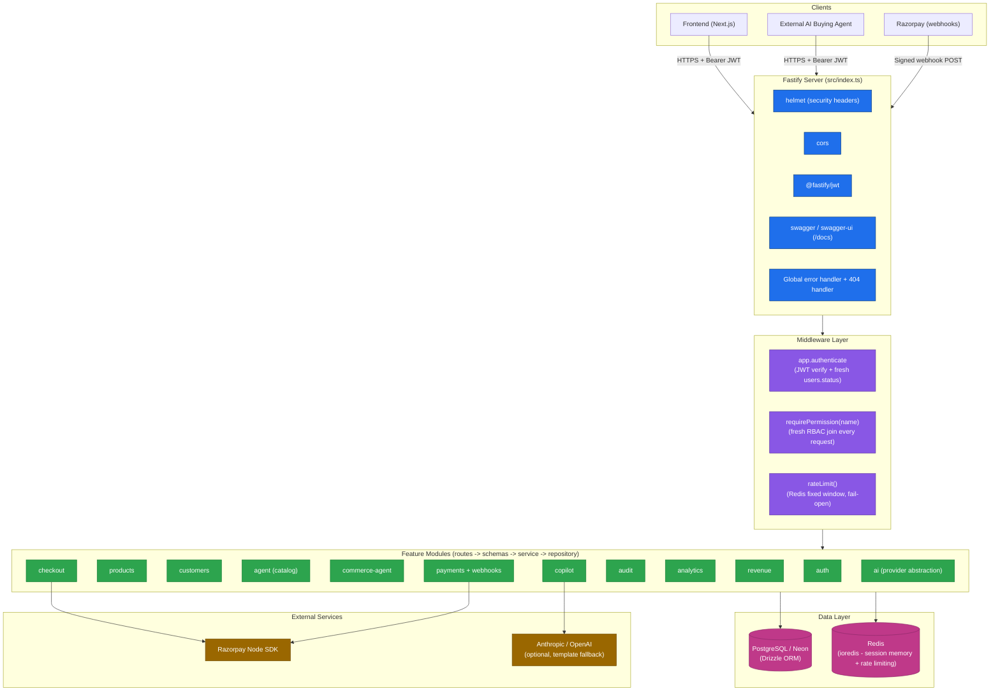

**Notes**

- There is no separate API gateway process — Fastify itself is the edge (plugin pipeline: helmet → cors → jwt → swagger → routes).
- Webhooks (`/api/v1/webhooks/razorpay`) are registered as an **independently encapsulated Fastify plugin**, deliberately not nested under `payments`, so its route-local raw-body parser (required for HMAC signature verification) can never leak into any other route's body parsing.
- Redis today is used for two things only: commerce-agent session memory (30-minute TTL) and rate-limit counters. It is explicitly **not** used as a catalog read cache yet (see §19).

---

## 4. Layered Architecture

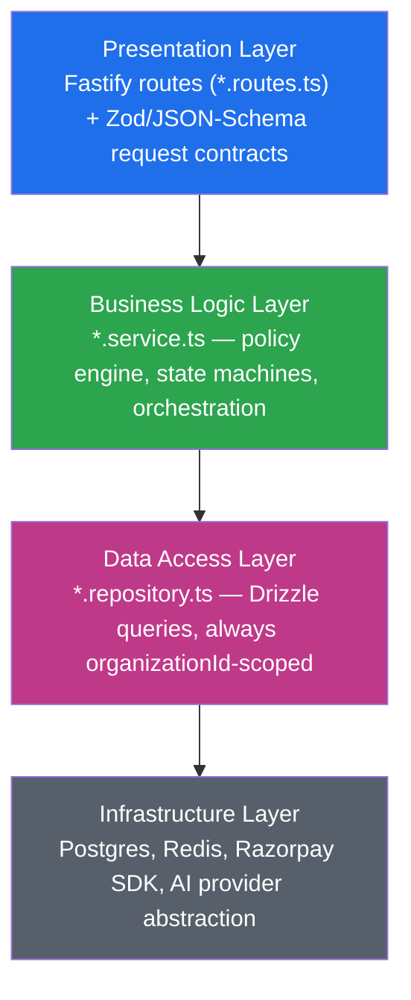

| Layer | Responsibility | Example |
|---|---|---|
| **Presentation** | Route registration, `preHandler` wiring (`authenticate` → `requirePermission` → `rateLimit`), calling `parseOrThrow()` on the Zod schema, shaping the response via `ok()`/`fail()`. Never contains business rules. | `checkout.routes.ts` wires `app.authenticate` + `requirePermission("ai.execute")` before calling the service. |
| **Business Logic** | Policy checks, state-machine transitions, orchestration across repositories, calling external providers (Razorpay, AI). This is where "can this checkout proceed?" and "is this webhook a duplicate?" are decided. | `checkout.service.ts`, `payment.service.ts`, `revenue.engine.ts`, `action-policy.service.ts`. |
| **Data Access** | Drizzle queries. Every method's **first parameter is `organizationId`**, included in every `WHERE`. This is defense-in-depth *above* the DB's own composite-FK tenant guarantees — a bug here still can't leak cross-tenant data because the DB itself would reject the write. | `products.repository.ts`, `orders.repository.ts`. |
| **Infrastructure** | Postgres (via `postgres` + Drizzle), Redis (`ioredis`), Razorpay SDK, and the pluggable AI provider. Nothing above this layer talks to these directly except through the layer immediately below it. | `db/index.ts`, `config/redis.ts`, `razorpay.client.ts`. |

---

## 5. Startup Flow

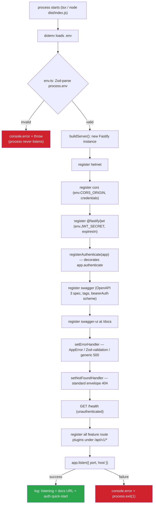

Key property: **any failure in `buildServer()` (bad plugin config, not just `listen()` failing) is caught by the same `try/catch` in `start()`** — a deliberate fix noted in `index.ts` comments, since an earlier version let `buildServer()` failures become unhandled promise rejections instead of a clean, logged exit.

There is no separate DB-connection-check step at boot — the `postgres` connection pool (10 connections, `db/index.ts`) is created lazily/eagerly at import time but the first real round-trip happens on the first query, not at `listen()`. Redis similarly connects lazily via `getRedisClient()` on first use (rate limiter, commerce session memory) and is designed to fail open (§14) rather than block boot.

---

## 6. Request Lifecycle

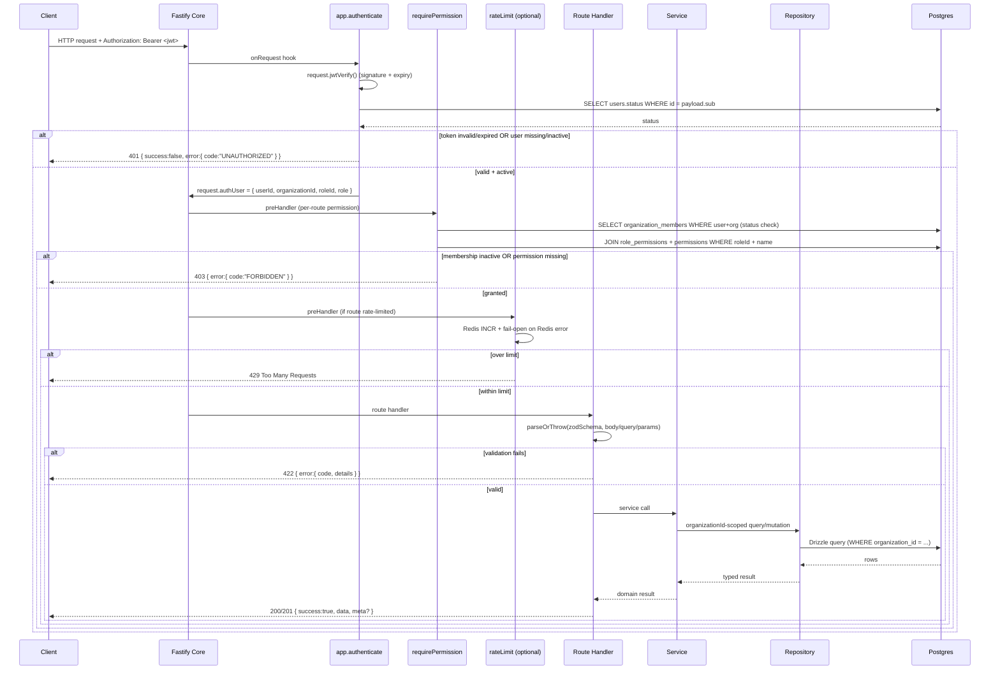

Every hop that can deny the request (auth, authz, validation, rate limit) does so with the **same response envelope** (`{ success: false, error: { code, message, details? } }`), so a client never has to special-case which layer rejected it.

---

## 7. Authentication

### Flow

```mermaid
sequenceDiagram
    participant C as Client
    participant Auth as auth.routes/service
    participant DB as Postgres

    Note over C,Auth: Registration
    C->>Auth: POST /auth/register { email, password, firstName, lastName, organizationName }
    Auth->>Auth: Zod: email valid; password 8-128 chars, >=1 letter, >=1 digit
    Auth->>Auth: bcrypt.hash(password, 12 rounds)
    Auth->>DB: BEGIN TX
    Auth->>DB: INSERT organizations
    Auth->>DB: INSERT users (passwordHash)
    Auth->>DB: SELECT roles WHERE name='ORG_ADMIN' (server-resolved, not client-supplied)
    Auth->>DB: INSERT organization_members (role=ORG_ADMIN)
    Auth->>DB: COMMIT
    Auth-->>C: 201 { user, organization } (no password hash, no token)
    Note over Auth: emitAudit(ORGANIZATION_CREATED), emitAudit(USER_REGISTERED) — after commit

    Note over C,Auth: Login
    C->>Auth: POST /auth/login { email, password }
    Auth->>DB: SELECT users WHERE email
    alt user not found
        Auth-->>C: 401 generic "invalid credentials"
    else found
        Auth->>Auth: bcrypt.compare(password, passwordHash)
        alt mismatch
            Auth-->>C: 401 generic "invalid credentials" (same message as not-found)
        else match
            Auth->>DB: SELECT organization_members (find an active org membership)
            alt user.status != active
                Auth-->>C: 401 (emitAudit USER_LOGIN_INACTIVE)
            else active
                Auth->>Auth: sign JWT { sub, organizationId, roleId, role }, expiresIn=JWT_EXPIRES_IN
                Auth-->>C: 200 { token, user, organization }
                Note over Auth: emitAudit(USER_LOGIN_SUCCESS)
            end
        end
    end

    Note over C,Auth: Authenticated requests
    C->>Auth: GET /auth/me (Bearer token)
    Auth->>DB: server-resolves user/org/role fresh from DB (never trusts JWT payload beyond IDs)
    Auth-->>C: 200 { user, organization, role }
```

### Design decisions worth preserving

- **Account-enumeration resistance:** unknown email and wrong password return the *identical* 401 code + message.
- **JWT payload is minimal:** `{ sub, organizationId, roleId, role }` — no permissions and no PII beyond IDs are embedded, because permissions are re-resolved from the DB on every request (see §8) rather than trusted from the token.
- **`users.status` is re-checked on every authenticated request**, not just at login — a user disabled mid-session is rejected on their very next request, not just after their token expires.
- **Registration is one Drizzle transaction** spanning org + user + membership creation — there is no code path that leaves a half-created org or an orphaned user.
- Password hashing uses **bcrypt at 12 rounds** with a 128-character input ceiling (`utils/password.ts`) specifically to bound bcrypt's own CPU cost against a maliciously long password (a bcrypt-specific DoS vector).

---

## 8. Authorization / RBAC

RBAC is **data, not code** — roles and permissions are rows, joined by `role_permissions`. Route handlers never compare a role *string*; they call `requirePermission("catalog.read")` and let the DB answer the question.

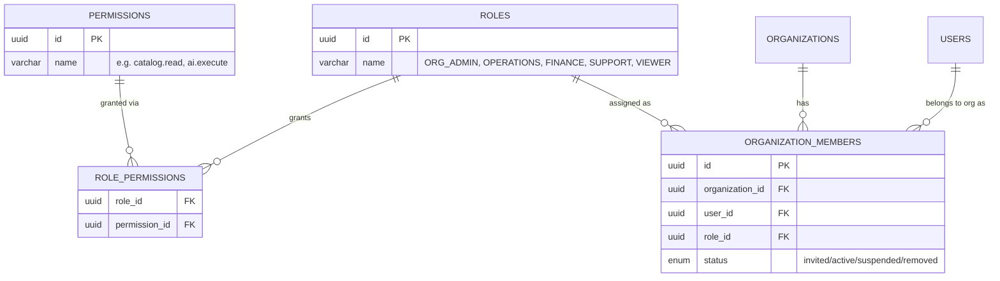

### Role matrix (per `Readme.md` / `scripts/seed.ts`)

| Role | Grants |
|---|---|
| **ORG_ADMIN** | Full org access — org/user/customer/catalog/order/payment/AI/audit, read + write + refund + execute |
| **OPERATIONS** | customers/catalog/orders read+write, payments read+create, `ai.execute`, audit read — **no** refund, `users.write`, `org.write` |
| **FINANCE** | orders read, payments read+refund, audit read — **no** catalog, AI, `customers.write` |
| **SUPPORT** | customers read+update, orders read, payments read, audit read — **no** payments create/refund, AI, catalog write, orders write |
| **VIEWER** | every `*.read` — no writes, no `payments.create/refund`, no `ai.execute` |

### Why re-resolve on every request instead of trusting the JWT

A role change, a membership suspension, or a permission grant/revoke must take effect **immediately** — not only once the holder's existing token expires (`JWT_EXPIRES_IN` defaults to 7 days, which would otherwise be a week-long window where a revoked permission still works). The cost is two extra indexed queries per protected request (`organization_members` lookup, then `role_permissions ⋈ permissions`); the tradeoff is judged worth it given the financial nature of the API.

### Adding a role or permission

Because RBAC is data, adding `MARKETING` as a new role with `analytics.read` + `customers.read` is **three `INSERT`s** (`roles`, then `role_permissions` rows) — zero route code changes.

---

## 9. Database Architecture (ER Diagram)

```mermaid
erDiagram
    ORGANIZATIONS ||--o{ ORGANIZATION_MEMBERS : has
    ORGANIZATIONS ||--o{ PRODUCTS : owns
    ORGANIZATIONS ||--o{ CUSTOMERS : owns
    ORGANIZATIONS ||--o{ ORDERS : owns
    ORGANIZATIONS ||--o{ REVENUE_OPPORTUNITIES : owns
    USERS ||--o{ ORGANIZATION_MEMBERS : "member via"
    ROLES ||--o{ ORGANIZATION_MEMBERS : "assigned"
    CUSTOMERS ||--o{ ORDERS : places
    ORDERS ||--o{ ORDER_ITEMS : contains
    PRODUCTS ||--o{ ORDER_ITEMS : "referenced by (nullable, ON DELETE SET NULL)"
    ORDERS ||--o{ PAYMENT_ATTEMPTS : "attempted via"
    PAYMENT_ATTEMPTS ||--o| PAYMENTS : "succeeds as (1:1)"
    ORDERS ||--o{ PAYMENTS : "paid via"
    USERS ||--o{ REVENUE_OPPORTUNITIES : "approves/executes"

    ORGANIZATIONS {
        uuid id PK
        varchar slug UK
        enum status "active/suspended/inactive"
        varchar currency "ISO 4217, default INR"
        varchar timezone
    }
    USERS {
        uuid id PK
        varchar email UK
        varchar password_hash "bcrypt only"
        enum status "invited/active/disabled"
    }
    ORGANIZATION_MEMBERS {
        uuid id PK
        uuid organization_id FK
        uuid user_id FK
        uuid role_id FK
        enum status
        note "UNIQUE(organization_id, user_id)"
    }
    ROLES {
        uuid id PK
        varchar name UK
    }
    PERMISSIONS {
        uuid id PK
        varchar name UK
    }
    PRODUCTS {
        uuid id PK
        uuid organization_id FK
        varchar slug "UNIQUE per org"
        text_array tags "GIN indexed"
        bigint price "integer minor units, >=0"
        int inventory_quantity ">=0"
        bool is_active
        note "UNIQUE(id, organization_id) for composite FK targets"
    }
    CUSTOMERS {
        uuid id PK
        uuid organization_id FK
        varchar external_customer_id "unique per org, nullable"
        enum status "active/inactive/blocked"
        note "UNIQUE(id, organization_id)"
    }
    ORDERS {
        uuid id PK
        uuid organization_id FK
        uuid customer_id "composite FK -> customers(id, organization_id)"
        varchar order_number "UNIQUE per org"
        varchar idempotency_key "UNIQUE per org, NULL-safe"
        enum status "pending/paid/partially_paid/cancelled/failed/refunded"
        bigint subtotal_amount
        bigint total_amount
    }
    ORDER_ITEMS {
        uuid id PK
        uuid order_id FK "CASCADE"
        uuid product_id FK "SET NULL — financial snapshot survives product deletion"
        varchar product_name "point-in-time snapshot"
        int quantity ">0"
        bigint unit_amount
    }
    PAYMENT_ATTEMPTS {
        uuid id PK
        uuid organization_id FK "RESTRICT"
        uuid order_id FK "RESTRICT"
        enum provider "razorpay"
        enum status "created/pending/authorized/captured/failed/cancelled"
        int attempt_number "1-based, unique per order"
        note "UNIQUE(id, order_id), UNIQUE(id, organization_id) for composite FK targets"
    }
    PAYMENTS {
        uuid id PK
        uuid organization_id FK "RESTRICT"
        uuid order_id FK "RESTRICT"
        uuid payment_attempt_id "composite FK -> payment_attempts(id, order_id) AND (id, organization_id)"
        enum status "captured/partially_refunded/refunded/failed"
        bigint amount ">0"
    }
    WEBHOOK_EVENTS {
        uuid id PK
        varchar provider
        varchar event_id
        enum status "RECEIVED/PROCESSED/IGNORED/FAILED"
        note "UNIQUE(provider, event_id) — durable dedupe"
    }
    AUDIT_LOGS {
        uuid id PK
        uuid organization_id "nullable, NOT a FK by design"
        enum actor_type "USER/AI_AGENT/SYSTEM"
        varchar action
        varchar resource_type
        varchar resource_id
        jsonb metadata "pre-scrubbed"
    }
    REVENUE_OPPORTUNITIES {
        uuid id PK
        uuid organization_id FK "CASCADE"
        enum type "CROSS_SELL/UPSELL/PAYMENT_RECOVERY/ABANDONED_CHECKOUT/REVENUE_DROP"
        varchar dedupe_key "UNIQUE per org — re-detection upserts, never duplicates"
        enum status "OPEN/APPROVED/REJECTED/EXECUTING/EXECUTED/FAILED/EXPIRED"
        int score "0-100"
        bigint estimated_revenue_impact
        jsonb evidence "engine-written only, never hand-edited or LLM-written"
        uuid executed_by FK "SET NULL"
    }
```

### Notable schema-design patterns

1. **Composite foreign keys as the tenant-isolation backstop.** `orders.customer_id` isn't a plain FK to `customers.id` — it's a composite FK to `(customers.id, customers.organizationId)`, which requires a matching `UNIQUE(id, organization_id)` on `customers`. This makes it *structurally impossible* at the database level for an order to reference a customer from a different organization, even if application code had a bug. The same pattern repeats for `payments → payment_attempts`.
2. **Money is always `bigint` (integer minor units), never `numeric`/`float`.** Every money column additionally has a `CHECK (... >= 0)` (or `> 0` for attempts/payments, since a zero-amount payment attempt is meaningless). Conversion to a human-readable decimal happens only at the API response boundary.
3. **`ON DELETE` policy encodes financial-record permanence.** `organizations`/`customers`/`products` cascade or set-null in ways that let a tenant clean up its own catalog, but `payment_attempts` and `payments` reference `organizations`/`orders` with `ON DELETE RESTRICT` — you cannot delete an organization or order out from under a financial record. `scripts/validate-step1.ts` exists specifically to assert these constraints hold, using savepoint-wrapped transactions that are always rolled back (so the validation script never leaves test data behind).
4. **Idempotency is a database unique index, not an in-memory guard.** `orders(organization_id, idempotency_key)` and `webhook_events(provider, event_id)` are both `UNIQUE` — this is explicitly called out in code comments as a requirement that survives multiple server instances/restarts, which an in-process `Set` or cache would not.
5. **`audit_logs` is deliberately not foreign-keyed** to `organizations`/`users` — some audit-worthy events (a failed login before any user exists, a rejected registration) have no valid FK target yet, and an audit write must never fail because of an unrelated FK violation. `organizationId`/`actorId` are still indexed for fast tenant-scoped reads even without the FK.
6. **GIN index on `products.tags`** so array-containment filters used by catalog/agent search stay index-backed rather than falling back to a sequential scan.

---

## 10. API Surface

All routes are under `/api/v1/...` and return the standard envelope:

```jsonc
// success
{ "success": true, "data": { /* ... */ }, "meta": { /* pagination, if a list */ } }

// error
{ "success": false, "error": { "code": "RESOURCE_NOT_FOUND", "message": "Product not found", "details": { /* validation only */ } } }
```

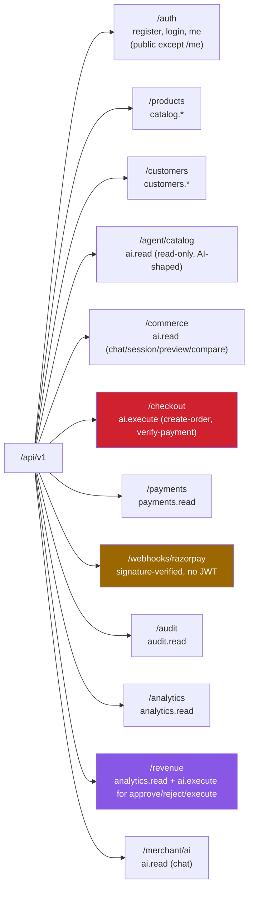

### Module → permission → mutates-money map

| Module | Base path | Required permission | Touches payments? |
|---|---|---|---|
| `auth` | `/auth` | none (public) / Bearer for `/me` | No |
| `products` | `/products` | `catalog.*` | No |
| `customers` | `/customers` | `customers.*` | No |
| `agent` | `/agent/catalog` | `ai.read` | No (read-only) |
| `commerce-agent` | `/commerce` | `ai.read` | No (previews only, never writes orders/payments) |
| `checkout` | `/checkout` | **`ai.execute`** | **Yes** — the only module allowed to talk to Razorpay for order creation |
| `payments` | `/payments` | `payments.read` | Read-only |
| `payments` (webhooks) | `/webhooks/razorpay` | signature, not JWT | Yes — state transitions from Razorpay events |
| `audit` | `/audit` | `audit.read` | No |
| `analytics` | `/analytics` | `analytics.read` | No (read-only aggregation) |
| `revenue` | `/revenue` | `analytics.read` (read) / `ai.execute` (approve/reject/execute) | Indirectly — execution reuses checkout's retry path |
| `copilot` | `/merchant/ai` | `ai.read` | No — bounded read-only tool layer only |

A full parameter-level endpoint table (query params, body shapes, response shapes) already exists in `backend/Readme.md` and is not duplicated verbatim here to avoid the two documents drifting out of sync — see that file's per-module sections for exact request/response contracts, or the live Swagger UI at `/docs`.

### Controller → Service → Repository pattern

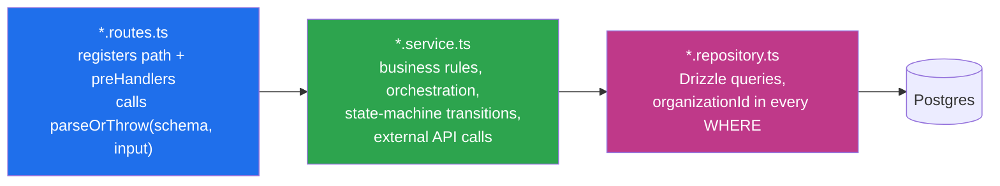

Business logic deliberately lives in the **service** layer, not the route handler or the repository: routes only translate HTTP ⇄ typed calls, and repositories only translate typed calls ⇄ SQL. This is what lets `revenue.service.ts`'s `executeOpportunity()` reuse `checkout.service.ts`'s retry/idempotent-order logic "verbatim" (per `Readme.md`) — the reusable unit is a service function, not a route.

---

## 11. Checkout & Payment State Machines

### End-to-end flow

```mermaid
sequenceDiagram
    participant AI as AI / Frontend
    participant CO as checkout.service
    participant Pol as Policy Engine
    participant DB as Postgres (TX)
    participant RZP as Razorpay

    AI->>CO: POST /checkout/create-order { sessionId, customerId, idempotencyKey? }
    Note over CO: No `amount` field exists on this endpoint —<br/>server always computes it server-side.
    CO->>Pol: checkPolicies + buildOrderPreview(cart)
    alt policy fails (empty cart, inactive product, budget, etc.)
        CO-->>AI: 422 with explanation, nothing written
    else policy passes
        CO->>DB: BEGIN TX
        CO->>DB: UPDATE products SET inventory_quantity -= qty WHERE inventory_quantity >= qty
        Note over DB: Atomic race-safe reservation — the guard is IN the SQL statement
        CO->>DB: INSERT orders (status=pending) + order_items snapshot
        CO->>DB: INSERT payment_attempts (status=created, attempt_number=1)
        CO->>DB: COMMIT
        CO->>RZP: create Razorpay order (outside the DB transaction)
        alt Razorpay call fails
            CO-->>AI: error; order stays pending, retry re-attempts Razorpay call
        else success
            CO-->>AI: { razorpayOrderId, keyId, amount, currency }
        end
    end
    AI->>AI: opens Razorpay Checkout with returned values
    Note over AI,RZP: buyer completes/fails a test-mode payment
    par explicit verification
        AI->>CO: POST /checkout/verify-payment { razorpayOrderId, razorpayPaymentId, razorpaySignature }
        CO->>CO: verify HMAC signature server-side (RAZORPAY_KEY_SECRET)
        CO->>DB: mark payment_attempt captured, order paid (idempotent vs. a racing webhook)
    and provider webhook
        RZP->>CO: POST /webhooks/razorpay (payment.captured / .authorized / .failed)
        CO->>DB: dedupe via webhook_events UNIQUE(provider,event_id), then same state transition
    end
```

### Payment attempt state machine

Centralized in `payment.service.ts` — **no other file is allowed to write `payment_attempts.status`.**

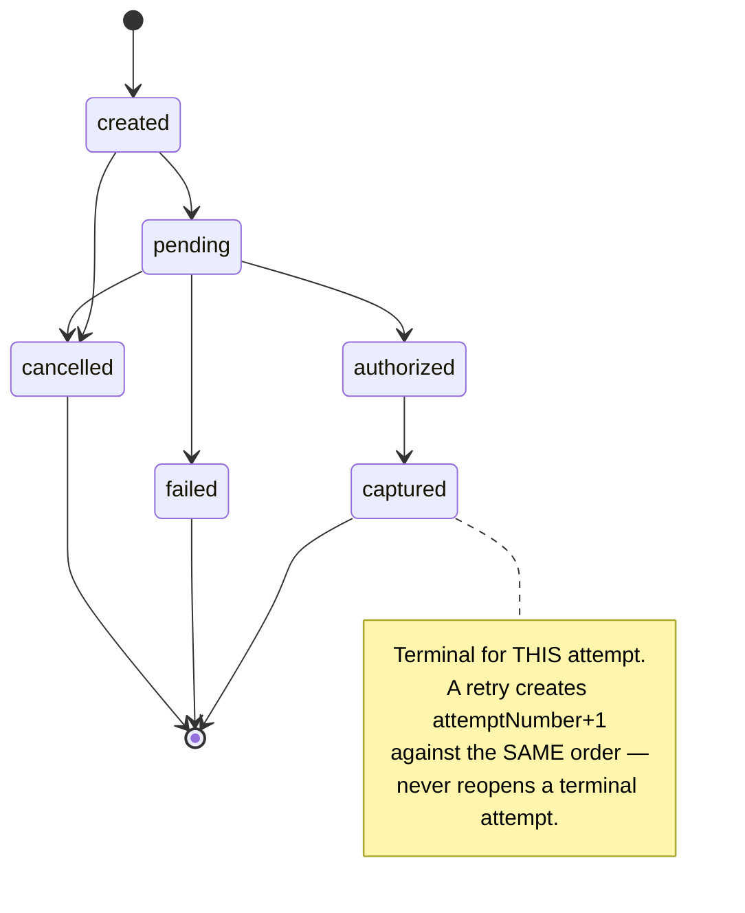

### Order state machine

Centralized in `orders.service.ts`.

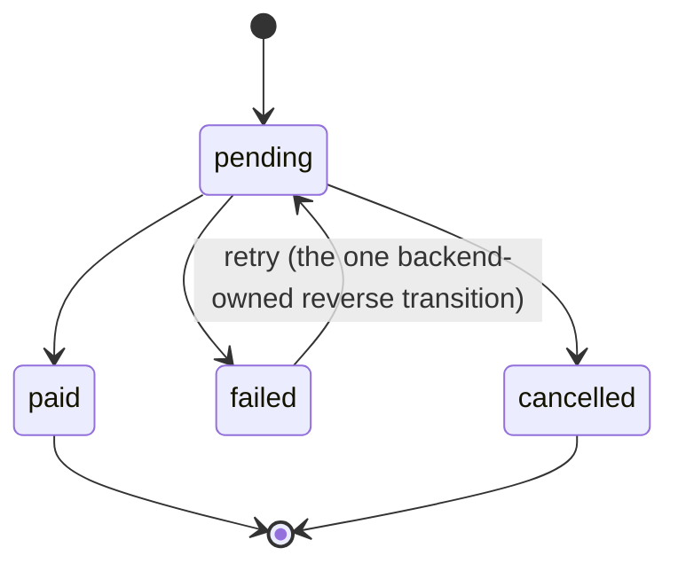

### Safety guarantees (as implemented, not aspirational)

| Guarantee | Mechanism |
|---|---|
| No amount tampering | `create-order` has no `amount` field at all; the total is recomputed server-side via the same `buildOrderPreview()` the commerce agent uses for previews. |
| No overselling under concurrency | Inventory decrement is a single `UPDATE ... WHERE inventory_quantity >= quantity` inside the order-creation transaction — the check and the act are the same atomic statement, not a separate read-then-write. |
| No duplicate orders on retry | `UNIQUE(organization_id, idempotency_key)` on `orders`, enforced by Postgres — survives multiple server instances and process restarts, unlike an in-memory guard. |
| No duplicate webhook processing | `UNIQUE(provider, event_id)` on `webhook_events`, checked via `INSERT ... ON CONFLICT DO NOTHING` *before* any state change. |
| Stock isn't lost on a failed payment | A terminal failure with no other attempt in flight triggers an `INVENTORY_RESTORED` audit event and restores the reserved quantity. |
| AI can't move money directly | Every checkout path — however it's reached (chat agent, revenue-opportunity execution) — funnels through this same service, `ai.execute` RBAC, the policy engine, and audit logging. There is no code path from the AI layer straight to the Razorpay SDK. |

---

## 12. Webhook Architecture

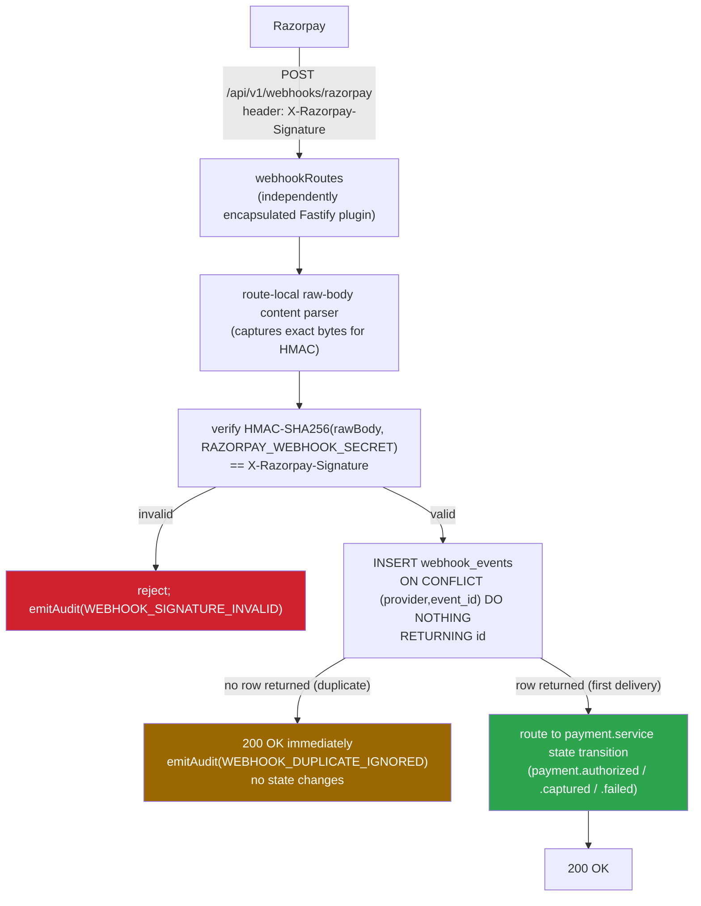

Why a dedicated plugin: Fastify's body parser is normally JSON-wide; webhook signature verification needs the **exact raw request bytes**, not the re-serialized JSON object, or the HMAC would never match. Isolating this into its own encapsulated plugin means the raw-body parser's scope can never accidentally apply to, say, `/checkout/create-order`.

---

## 13. Audit Trail

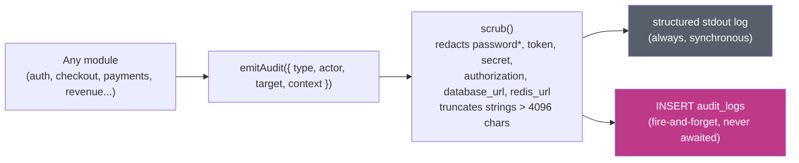

`emitAudit()` is guaranteed to **never throw** — a DB hiccup on the audit write can never break the request path it's attached to (auth, checkout, webhook processing). This is a deliberate reliability trade-off: audit completeness is secondary to primary-path availability.

Every event carries the "who / what / when / why / result" shape: `actor` (`USER`/`AI_AGENT`/`SYSTEM` + id), `action` + `resourceType`/`resourceId`, `createdAt`, `reason`, and scrubbed `metadata`. `GET /api/v1/audit` (requires `audit.read`) exposes this, filterable by `resourceType`/`resourceId`/`action`, organization-scoped.

---

## 14. Rate Limiting

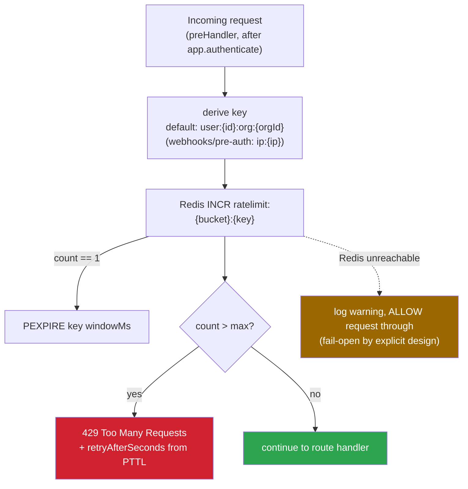

**Design rationale (from code comments):** a rate limiter is defense-in-depth, not the actual money-safety mechanism — idempotency keys, compare-and-swap state transitions, and unique constraints at the DB level are what actually protect financial correctness. So if Redis itself is down, the rate limiter fails **open** (allows the request, logs a warning) rather than turning a Redis outage into a checkout/payment/webhook outage. This is a fixed-window `INCR`+`PEXPIRE` counter, not a sliding-window Lua script — the documented trade-off is a few-millisecond race on the very first request of a window that could, in the worst case, slightly under-enforce (never over-enforce) the limit.

---

## 15. Error Handling

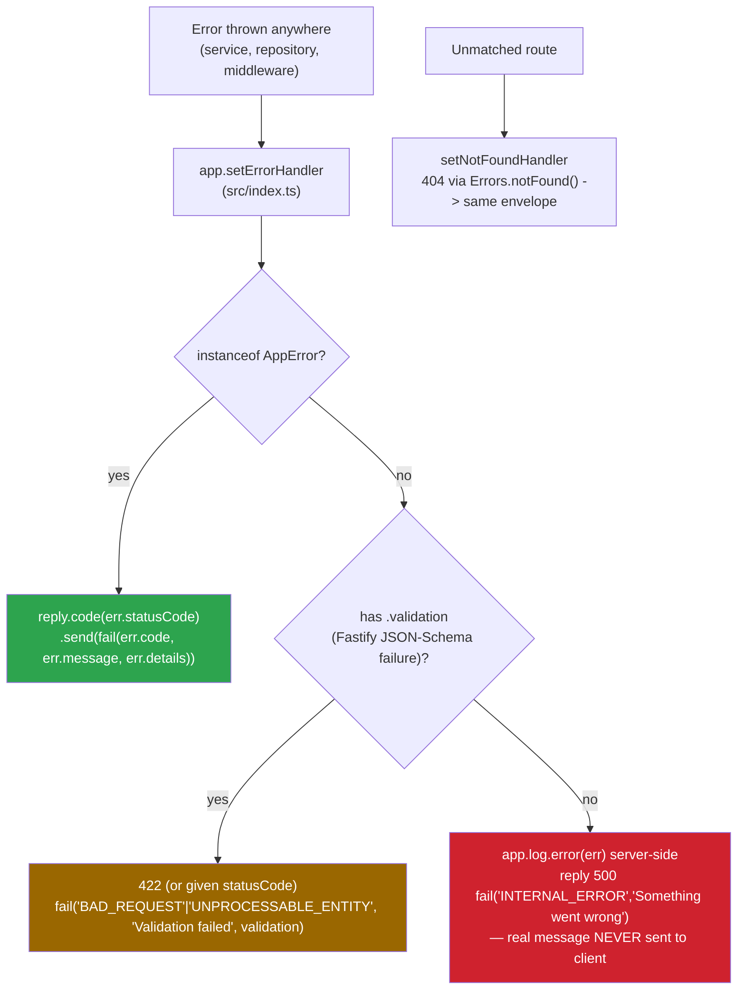

`AppError` (in `utils/errors.ts`) is a typed error class with a `code`/`statusCode`/optional `details`, and `Errors` is a factory for the common cases (`Errors.notFound()`, `Errors.forbidden()`, `Errors.unauthorized()`, `Errors.tooManyRequests()`, etc.) — every 4xx in the API traces back to one of these factory calls, not an ad-hoc `reply.code(x).send(y)` scattered through route handlers. **Zod is the actual validation engine** (`parseOrThrow()`); the Fastify JSON Schemas in each module's `*.schemas.ts` exist only so Swagger UI can render an accurate request/response shape — they are documentation mirrors, not enforcement.

No stack traces, bcrypt internals, raw SQL error text, or secrets are ever serialized into a client response — unexpected errors are logged server-side (`app.log.error`) and returned to the client as a generic `INTERNAL_ERROR` / "Something went wrong".

---

## 16. AI / Agentic Layer

Three distinct AI-adjacent surfaces exist, each with a different trust boundary — this is worth being explicit about because "AI" in this codebase does **not** mean "an LLM decides things":

| Surface | Module | What's actually AI/LLM-driven today | What's deterministic |
|---|---|---|---|
| **Agent Catalog** | `agent/` | Nothing — this is a machine-shaped read API an *external* AI agent would call. | 100%: filtering, search matching, upsell/cross-sell scoring (`UPSELL` = same category + strictly higher price; `CROSS_SELL` = shared tag, different category), all with an explainable `reasons[]` array. |
| **Commerce Agent** | `commerce-agent/` | Nothing yet — intent/filter extraction is pattern matching (`intent.service.ts`), deliberately isolated behind a swappable `IntentExtractor` interface so an LLM implementation can drop in later without touching downstream code. | Cart/session state, `matchScore`/`matchReasons` ranking, the policy engine (active/in-stock/inventory/budget checks), order-preview math. |
| **Revenue Engine** | `revenue/` | Nothing — `revenue.engine.ts`'s scoring formula is a documented, hand-traceable arithmetic function, never model output. | Everything: detection (`CROSS_SELL`/`UPSELL`/`PAYMENT_RECOVERY`/`ABANDONED_CHECKOUT`/`REVENUE_DROP`), `score`/`confidence`/`estimatedRevenueImpact`, and the `action-policy.service.ts` gate before execution. |
| **AI Copilot** | `copilot/` + `ai/` | Yes, optionally — an actual LLM call (Anthropic or OpenAI, at most one configured; falls back to a deterministic template if neither is set or the provider errors mid-conversation). | The copilot can **only** see organization data through a bounded, read-only tool layer (`copilot.tools.ts`) — revenue overview/trend, product/payment analytics, opportunity lookups. No direct DB access, no client-suppliable `organizationId`, and the tool loop is capped at 4 iterations. It requires `ai.read`, never `ai.execute` — it cannot move money. |

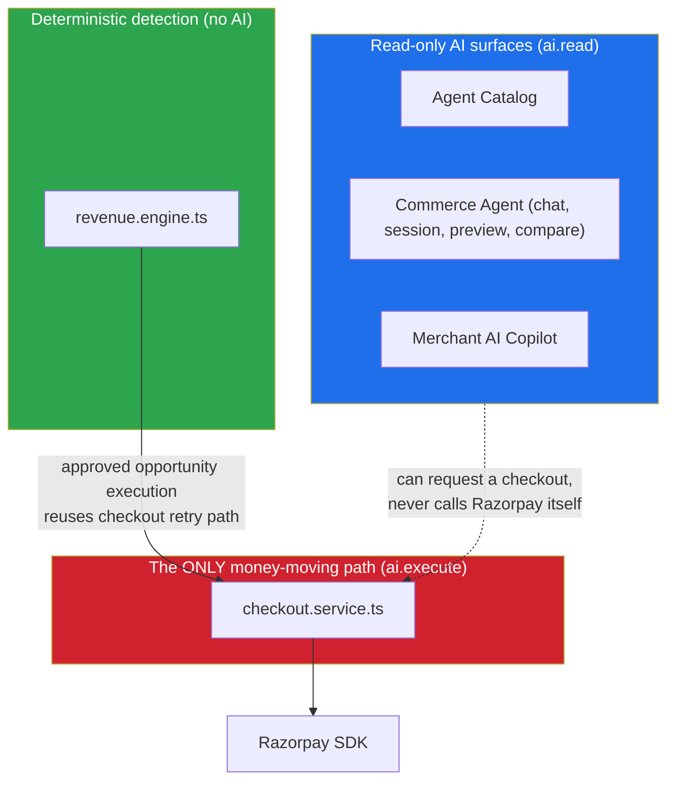

The revenue-opportunity **execution** path (`POST /revenue/opportunities/:id/execute`) is worth calling out specifically: it does **not** charge a buyer directly (no payment gateway allows a merchant to unilaterally debit a buyer without their own authorization step) — it *prepares* a fresh payment attempt/checkout using the exact same idempotent retry code path checkout already has, gated by `action-policy.service.ts` (status must be `APPROVED`, not expired, action type must be one this system can carry out, impact must be under `REVENUE_ACTION_MAX_AMOUNT_MINOR`). The `APPROVED → EXECUTING` transition is a compare-and-swap in the repository layer, so two concurrent execute calls for the same opportunity can't both run — the loser gets a `409`.

---

## 17. Security Posture

### Enforced today (verified against `middleware/`, `utils/`, `db/schema/`, `env.ts`)

| Control | Where |
|---|---|
| Password hashing | bcrypt, 12 rounds, 128-char input ceiling — `utils/password.ts` |
| JWT | `@fastify/jwt`, HS256, secret ≥16 chars enforced by `env.ts`'s Zod schema, minimal payload (no permissions/PII) |
| Fresh-per-request RBAC | `authorize.ts` re-joins `organization_members ⋈ role_permissions ⋈ permissions` every request — no trust in the JWT's embedded role beyond identifying *which* role to look up |
| Fresh-per-request account status | `authenticate.ts` re-selects `users.status` every request |
| Tenant isolation (app layer) | every repository method takes `organizationId` first and includes it in every `WHERE` |
| Tenant isolation (DB layer) | composite FKs (`orders→customers`, `payments→payment_attempts`) make cross-tenant references physically unrepresentable |
| Tenant non-disclosure | cross-org lookups return `404`, never `403` — a client can't distinguish "doesn't exist" from "exists in another tenant" |
| Enumeration resistance | login returns one generic message/code for unknown-email and wrong-password |
| 401 vs 403 discipline | unauthenticated → 401, authenticated-but-unauthorized → 403, consistently |
| Transactional integrity | registration (org+user+membership) and checkout (inventory+order+order_items+attempt) are each one DB transaction |
| Financial-record durability | `payment_attempts`/`payments` use `ON DELETE RESTRICT` toward `organizations`/`orders`; verified by `scripts/validate-step1.ts` |
| Idempotency at the DB layer | `UNIQUE(organization_id, idempotency_key)` on `orders`; `UNIQUE(provider, event_id)` on `webhook_events` |
| Secret hygiene | `.env` gitignored, `.env.example` placeholders only; `emitAudit()`'s `scrub()` redacts `password*`/`token`/`secret`/`authorization`/`database_url`/`redis_url` before persistence |
| Error hygiene | generic 500 to clients; real cause logged server-side only |
| Security headers | `@fastify/helmet` registered at defaults |
| CORS | single-origin allow-list via `CORS_ORIGIN` |
| Webhook auth | HMAC-SHA256 over the exact raw request bytes, not JWT |
| Rate limiting | Redis-backed, fail-open, scoped per-org/user (or per-IP pre-auth) |
| DoS-hardened audit strings | `scrub()` truncates any string >4096 chars |

### Explicitly planned, not yet built (per `Readme.md`'s own "Planned" section)

| Gap | Why it matters | Suggested owner |
|---|---|---|
| No refresh tokens — single 7-day access token | A stolen token is valid for up to a week with no revocation mechanism short of a DB-level user disable | `auth/` — access (short, e.g. 15 min) + revocable refresh token stored in Redis/DB |
| No `request.id`/`request.ip` wired into audit `context` | Harder to correlate a specific audit event to a specific client session during an incident review | one global `preHandler` |
| Helmet at defaults, no environment-specific CSP | Default CSP is a reasonable baseline but not tailored to the actual deployed frontend origin | infra/deploy config |
| Only `RAZORPAY_KEY_ID`/`SECRET`/`WEBHOOK_SECRET` — no secrets-manager integration | Fine for a hackathon/demo deployment; a production deployment on shared infra would want Vault/Secrets Manager/KMS rather than a flat `.env` | deployment tooling, not app code |

---

## 18. Testing

Integration tests run against a **real** Postgres instance (Neon), not mocks — each test creates its own organization/users/products/customers with random UUID suffixes, so the suite is safely re-runnable without a cleanup step.

| File | Coverage |
|---|---|
| `tests/auth.test.ts` | 33 top-level `test()` calls / 36+ assertions across: registration+login+validation (B-series), JWT+middleware (C-series, including a disabled-user-mid-session 401), RBAC least-privilege matrix per role (D-series), tenant isolation incl. multi-org users (E-series), seed idempotency (G1) |
| `tests/agent.test.ts` | Catalog filters (tags/price-range/availability/sort/pagination), agent-shaped response fields, org scoping, structured `AgentSearchIntent` filtering, UPSELL/CROSS_SELL correctness |
| `tests/commerce.test.ts` | `/commerce/chat` auth gating, deterministic search ranking + explanations, `ADD_TO_CART` session writes, session GET/DELETE + cross-org session isolation, policy engine (empty-cart, inventory-exceeded), order-preview math, `/commerce/compare` |
| `tests/checkout.test.ts` | Milestone 5 checkout flow |
| `tests/webhook.test.ts` | Signature verification + dedupe behavior |
| `scripts/validate-step1.ts` | Standalone: 5/5 DB-constraint proofs (cross-tenant customer/payment rejection, payment↔order consistency, org/order delete restriction) — every assertion runs inside a transaction that is always rolled back, so it never leaves data behind |

**Not yet covered** (per `Readme.md`'s own "Still open" list): `analytics`, `revenue` (including `/execute`'s policy engine and its idempotency), `copilot`, and `audit` have no integration tests yet — only auth/agent/commerce/checkout/webhook do.

---

## 19. Strengths, Gaps & Recommendations

### Strengths

- **Tenant isolation is enforced at three independent layers** (JWT never trusted for identity beyond IDs → repository-level `organizationId` filtering → DB-level composite FKs) rather than relying on any single one. This is unusually rigorous for a project at this stage.
- **Money handling follows fintech-grade conventions throughout**: integer minor units everywhere, no float, server-computed amounts with no client-suppliable `amount` field on the checkout endpoint, DB-level idempotency, `ON DELETE RESTRICT` on financial tables backed by an actual constraint-proof script.
- **RBAC-as-data** means role/permission changes are operational (SQL), not a deploy.
- **The AI-boundary discipline is explicit and consistent**: every AI-adjacent module documents (in code comments and in `Readme.md`) exactly why it can or can't move money, and the one module that can (`checkout`) is the single funnel every other path — including the revenue engine's own execution — is forced through.
- **Fail-open vs. fail-closed choices are deliberate, not accidental**: rate limiting fails open (availability > throttling precision) while payment-provider configuration and signature verification fail closed (correctness > availability) — the right choice in each case, and documented as such in code comments.
- **Self-documentation quality is high.** `Readme.md` alone already covers most of what a "FAANG-style onboarding doc" would need — API contracts, state machines, RBAC matrix, security checklist, milestone history. This document supplements it with diagrams and cross-references rather than duplicating it.

### Gaps / risks (not fixed yet, and the project's own docs agree)

1. **Single long-lived JWT, no refresh/revocation path.** Highest-priority item if this were headed to production — a leaked token is valid for up to `JWT_EXPIRES_IN` (7 days by default) with no way to revoke it short of disabling the user account outright.
2. **No caching layer for the catalog**, despite Redis already being present in the stack — every catalog/agent-catalog read hits Postgres. Fine at demo scale; would need addressing under real read traffic (`GET /products`, `GET /agent/catalog`).
3. **Test coverage stops at Milestone 5.** `analytics`, `revenue` (especially the `/execute` policy engine and its CAS-based concurrency guarantee), `copilot`, and `audit` have zero integration tests today — these are exactly the modules with the newest and most novel logic (deterministic scoring formulas, LLM-provider fallback behavior), which is where regressions would be easiest to introduce unnoticed.
4. **`REVENUE_ACTION_MAX_AMOUNT_MINOR`-gated execute path requires an unapplied migration** (four new nullable columns on `revenue_opportunities`) per the README's own "Still open" note — worth confirming `npm run db:generate && npm run db:migrate` has actually been run in every environment before relying on `/execute`.
5. **No secrets manager** — acceptable for a hackathon-scale deployment on a single `.env`, but flagged in the README itself as a production gap.
6. **CORS/CSP are single-origin defaults**, not yet hardened per-environment (dev vs. staging vs. prod origins).

### Recommended priority order (if this moves toward production)

| Priority | Item | Rationale |
|---|---|---|
| Immediate | Access + refresh token split | Closes the largest window-of-compromise gap; schema is already anticipated in the README |
| Immediate | Run/verify the `revenue_opportunities` execute-columns migration everywhere `/execute` is used | Currently a documented but unconfirmed gap |
| Short-term | Integration tests for `revenue`/`analytics`/`copilot`/`audit` | These are the newest, least-covered, most novel-logic modules |
| Short-term | Wire `request.id`/`request.ip` into every audit event globally | Straightforward (one `preHandler`), meaningfully improves incident-review quality |
| Long-term | Redis-backed catalog read cache | Only matters once catalog read volume actually grows past what Postgres alone comfortably serves |
| Long-term | Secrets manager integration | Only matters once this leaves single-instance/demo deployment |

---

*End of document. This file lives at `documentation/Backend_Architecture.md` alongside `Problem_Statement.md` and `Tech_stack.md`. For exact, code-verified per-endpoint request/response contracts and a full internals walkthrough of the analytics repository, the revenue-opportunity scoring formula, the action-execution policy engine, and the commerce-agent's intent/policy engines, see `documentation/Backend_API_Reference.md`. Cross-reference `backend/Readme.md` for the living, most frequently updated prose API table.*
